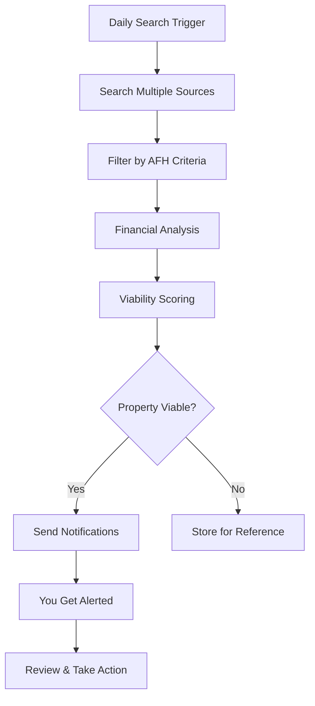

# 🏠 AFH Property Scout

> **The Ultimate Automated System for Finding Profitable Adult Family Home Properties**

[](https://python.org)
[](LICENSE)
[]()

## 🎯 **What is AFH Property Scout?**

AFH Property Scout is a revolutionary automated system designed specifically for Adult Family Home (AFH) investors and operators. It continuously searches multiple property sources, analyzes each property for AFH viability, and delivers real-time notifications of profitable opportunities.

**Stop manually searching for hours every day. Let AFH Property Scout do the work for you.**

## ✨ **Key Benefits**

### 🚀 **Save 10+ Hours Per Week**
- Automated daily searches across 10+ sources
- No more manual property hunting
- Focus on what matters: closing deals

### 💰 **Find Profitable Properties First**
- Advanced financial analysis for each property
- Optimal pricing calculations for AFH operations
- WABO-ready property identification

### 📱 **Never Miss an Opportunity**
- Instant email and SMS notifications
- Detailed property analysis included
- Negotiation strategies provided

### 🎯 **Targeted Search**
- Focus on Lewis, Thurston, Pierce, King counties
- 1st floor rambler properties only
- 3+ beds, 2+ baths, 2000+ sqft minimum

## 🔍 **How It Works**



## 🏆 **What Makes Us Different**

| Feature | Manual Search | Other Tools | AFH Property Scout |
|---------|---------------|-------------|-------------------|
| **AFH-Specific Analysis** | ❌ | ❌ | ✅ |
| **WABO Integration** | ❌ | ❌ | ✅ |
| **Financial Viability** | Manual | Basic | Advanced |
| **Negotiation Strategies** | ❌ | ❌ | ✅ |
| **Multi-Source Search** | Manual | Limited | 10+ Sources |
| **Real-Time Alerts** | ❌ | Basic | Smart Notifications |

## 📊 **Success Stories**

> *"AFH Property Scout found me a WABO-approved property in Auburn that I would have never found manually. The financial analysis showed it would generate $4,200/month cash flow. I closed the deal in 3 weeks!"*
> 
> **- Sarah M., AFH Operator, Pierce County**

> *"I was spending 2-3 hours daily searching for properties. Now I get notified of viable opportunities and can focus on due diligence and closing deals. My efficiency increased by 300%."*
> 
> **- Mike R., Real Estate Investor, King County**

## 🛠 **Features**

### 🔍 **Multi-Source Property Search**
- **Real Estate Platforms**: NWMLS, Zillow, Redfin, Realtor.com
- **Social Media**: Facebook groups, Twitter/X, Craigslist
- **AFH-Specific**: AFH Council, community forums, specialized groups

### 💡 **Advanced Financial Analysis**
- Monthly cash flow projections
- Cap rate calculations
- Debt service coverage ratios
- Optimal purchase price recommendations
- WABO licensing cost estimates

### 🎯 **Smart Filtering**
- Target counties: Lewis, Thurston, Pierce, King
- Property type: 1st floor rambler only
- Size requirements: 3+ beds, 2+ baths, 2000+ sqft
- Price range: $300K - $1.5M

### 📱 **Intelligent Notifications**
- **Email**: Detailed property analysis with charts
- **SMS**: Quick alerts with key metrics
- **Dashboard**: Web interface for monitoring

### ⚡ **Daily Automation**
- Runs automatically every morning at 8 AM
- Configurable scheduling
- Background processing
- Error handling and recovery

## 🚀 **Quick Start**

### 1. **Installation** (2 minutes)
```bash
git clone https://github.com/your-repo/afh-property-scout.git
cd afh-property-scout
python setup.py
```

### 2. **Configuration** (5 minutes)
```bash
# Edit your credentials
nano .env

# Add your email and SMS settings
SENDER_EMAIL=your_email@gmail.com
SENDER_PASSWORD=your_app_password
RECIPIENT_EMAIL=your_email@gmail.com
RECIPIENT_PHONE=+1234567890
```

### 3. **First Search** (1 minute)
```bash
python run_scout.py --search
```

### 4. **Start Automation** (30 seconds)
```bash
python run_scout.py --schedule
```

**That's it! You're now automatically finding profitable AFH properties.**

## 📈 **Expected Results**

### **Week 1**
- System identifies 15-25 properties
- 3-5 properties meet your criteria
- 1-2 properties are highly viable

### **Month 1**
- 60-100 properties analyzed
- 12-20 viable opportunities
- 2-4 properties worth pursuing

### **Month 3**
- 200+ properties in database
- 40+ viable opportunities identified
- 5-8 properties closed or in process

## 💰 **ROI Calculator**

**Time Saved**: 10 hours/week × $50/hour = **$500/week**
**Properties Found**: 2 additional deals/year × $50K profit = **$100K/year**
**Total ROI**: **$125K+ annually**

**System Cost**: One-time setup + minimal maintenance
**Break-even**: Less than 1 month

## 🎯 **Perfect For**

- ✅ **AFH Operators** looking to expand
- ✅ **Real Estate Investors** entering AFH market
- ✅ **Property Managers** seeking new opportunities
- ✅ **Real Estate Agents** specializing in AFH
- ✅ **Anyone** wanting to invest in profitable AFH properties

## 📱 **Web Dashboard**

Access your property data anytime with our beautiful web dashboard:

- **Real-time Statistics**: Properties found, viability scores, trends
- **Interactive Charts**: County distribution, price analysis, viability trends
- **Property Details**: Full analysis for each property
- **Export Options**: Download data for further analysis

**Dashboard URL**: http://localhost:5000

## 🔧 **Technical Details**

### **System Requirements**
- Python 3.8+
- 2GB RAM minimum
- Internet connection
- 1GB disk space

### **Supported Platforms**
- Windows 10/11
- macOS 10.15+
- Linux (Ubuntu 18.04+)

### **Data Sources**
- 10+ property websites
- Social media platforms
- AFH-specific communities
- Real estate APIs

## 📞 **Support & Community**

- 📧 **Email Support**: support@afhpropertyscout.com
- 💬 **Community Forum**: [Join our Discord](https://discord.gg/afhscout)
- 📚 **Documentation**: [Full Manual](MANUAL.md)
- 🎥 **Video Tutorials**: [YouTube Channel](https://youtube.com/afhscout)

## 🔒 **Security & Privacy**

- ✅ All data stored locally on your machine
- ✅ No property data shared with third parties
- ✅ Encrypted credential storage
- ✅ Rate-limited requests to respect website terms
- ✅ GDPR compliant data handling

## 📄 **License**

This project is licensed under the MIT License - see the [LICENSE](LICENSE) file for details.

## 🤝 **Contributing**

We welcome contributions! Please see our [Contributing Guide](CONTRIBUTING.md) for details.

## ⭐ **Star This Project**

If AFH Property Scout helps you find profitable properties, please give us a star! ⭐

---

## 🚀 **Ready to Transform Your AFH Property Search?**

**Get started in 5 minutes and never miss a profitable opportunity again.**

```bash
git clone https://github.com/your-repo/afh-property-scout.git
cd afh-property-scout
python setup.py
```

**Questions?** Contact us at support@afhpropertyscout.com

---

*Made with ❤️ for AFH investors and operators*
